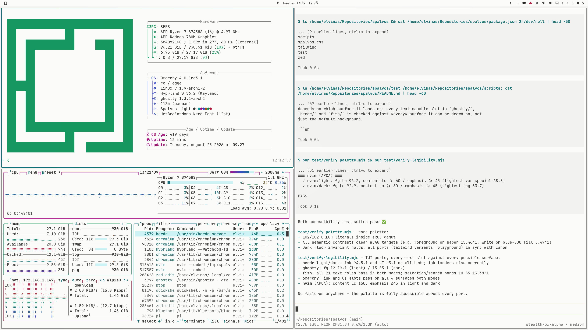

# Spalvos Light — Omarchy theme

Mirror of [`spalvos`](https://github.com/elvinaspredkelis/spalvos)'s
`omarchy/spalvos-light` — a standalone repo so Omarchy can install it
directly. Requires Omarchy 4.



## Install

Omarchy menu → Install → Style → Theme, paste this repo's URL. Or:

```sh
omarchy theme install https://github.com/elvinaspredkelis/omarchy-spalvos-light
```

## Neovim

Omarchy refuses Lua from a git-installed theme, so `neovim.lua` here is
ignored on install and Omarchy generates its own from `colors.toml` — same
palette, generic syntax mapping. For the hand-tuned Spalvos colorscheme
(one hue family per token, matching lualine theme), install it from the
[main repo](https://github.com/elvinaspredkelis/spalvos): `nvim/`.

## Do not edit here

Generated by `bin/spalvos-mirror-omarchy` in the main repo. Palette
changes belong in [spalvos](https://github.com/elvinaspredkelis/spalvos) —
issues and PRs there, please.
